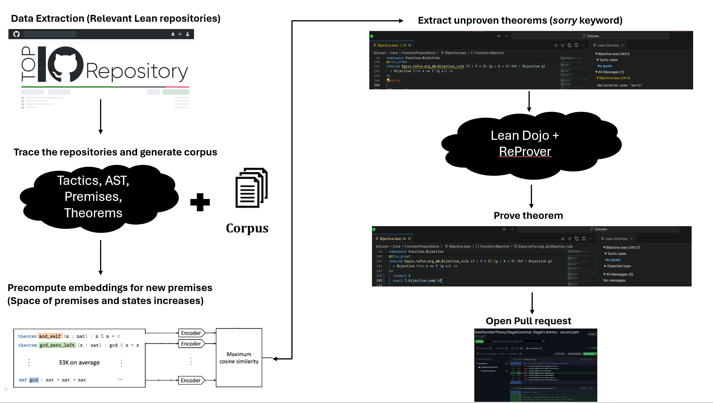

# LeanBot




https://github.com/Adarsh321123/CS159FinalProject/assets/56987323/de0cb397-8dc7-40ed-9f16-995c73caacb3


## [Example PR](https://github.com/Adarsh321123/pfr/pulls)

Lean 3 is deprecated. The `main` branch only supports Lean 4.

[](https://github.com/MineDojo/MineDojo/blob/main/LICENSE) [](https://github.com/psf/black)


## Instructions

### Requirements

1. **Ensure you are on `backup_branch`. We would like to make some more progress before merging into `main`.**
2. Download and install [Miniconda Python 3](https://docs.conda.io/en/latest/miniconda.html) (Anaconda should also work).
3. Create the conda environment and install Python dependencies:
```bash
conda create --yes --name ReProver python=3.10 ipython numpy
conda activate ReProver
pip install torch --index-url https://download.pytorch.org/whl/cu121  # Depending on your CUDA version; see https://pytorch.org/.
pip install tqdm loguru deepspeed "pytorch-lightning[extra]" transformers tensorboard openai rank_bm25 lean-dojo
```
4. Make sure `wget` and `tar` are available. Then, update the download paths in `prover/download_model_generator.py` and `prover/download_model_retriever.py` and run them to download the `retriever-tacgen` and `retriever` models.
5. Satisfy the requirements of [LeanDojo](https://github.com/lean-dojo/LeanDojo#requirements).
6. If you want to run this pipeline on many repos, you will need to install Lean toolchains from `v4.3.0-rc2` to `v4.8.0-rc2`.
7. Change the necessary details in `run_code.sh`, such as your GitHub access token and directory to cache the Lean repos. Update `main.py` and `prover/proof_search.py` according to the documentation below. Then, run `chmod +x run_code.sh` and `bash run_code.sh`

Please refer to [LeanDojo's documentation](https://leandojo.readthedocs.io/en/latest/) or [ReProver's documentation](https://github.com/lean-dojo/ReProver) if you encounter any issues.

The models we use are available on the HuggingFace Hub:

| Model name | Model architecture | Input | Output |
| ---------- | ------------------ | ----- | ------ |
| [kaiyuy/leandojo-lean4-retriever-byt5-small](https://huggingface.co/kaiyuy/leandojo-lean4-retriever-byt5-small) | ByT5 (encoder-only) | Proof state | Embedding |
| [kaiyuy/leandojo-lean4-retriever-tacgen-byt5-small](https://huggingface.co/kaiyuy/leandojo-lean4-retriever-tacgen-byt5-small) | ByT5 (encoder-decoder) | Retrieved premises + proof state | Tactic |

## Brief Documentation

- `run_code.sh`: Convenience script to set up the environment before calling `main.py`. Make sure to change the necessary details, such as your GitHub access token and directory to cache the Lean repos, before running it.
- `results_w_retrieval.json`: Detailed results of the retrieval-based model on all repos besides SciLean.
- `scilean_results_w_retrieval.txt`: Detailed results of the retrieval-based model on SciLean.
- `results_wo_retrieval.json`: Detailed results of the generation-only model on all repos.
- `prover/proof_search.py`: This is the code that does the proof search. Update `"ret_ckpt_path"` in the `config` dictionary in `GpuProver` to where your `retriever` model checkpoint is. Or, set it to `None` if you want to run without retrieval.
- `main.py`: This is the driver code. Please see the commments to better understand what it does. To use it, change any parameters you would like, such as numbers of cloned repos, directory to clone the repos to, directory to generate corpuses in, where to save the results, where the Lean toolchains and models are, etc. Then, run `python main.py`.
- `prover/download_model_generator.py`: This downloads the `retriever-tacgen` model from HuggingFace. Make sure to change the download directory before running it.
- `prover/download_model_retriever.py`: This downloads the `retriever` model from HuggingFace. Make sure to change the download directory before running it.

## Known Issues

- Sending the output of the bash script to a file or automating the process with a program like CRON leads to a `PicklingError`. This error is currently being investigated.
